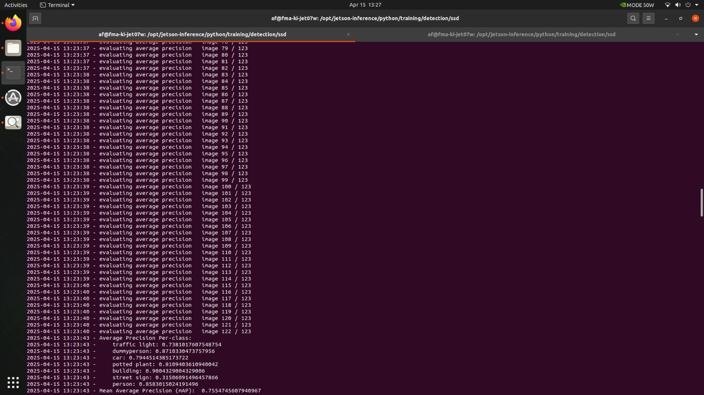

# Object Detection

## Description
The Object Detection node uses a Realsense camera to capture images and detect street-relevant objects such as cars, people, buildings,
traffic lights, and signs. It runs a deep learning model trained through transfer learning to achieve improved accuracy. The main goal was to
increase the mAP to 75%, which was successfully reached at epoch 287.
The node takes camera input, performs inference using the trained .onnx model, and outputs the detected objects in real time for further use
in navigation or visualization.

## Author
**Vaithiyanathan Alagar**

## Installation

Firstly for setting up the environment, Clone the detectnet for ros2

```
    git clone https://github.com/dusty-nv/ros_deep_learning.git
```

Next, build and source the files

```
    colcon build
    source install/setup.bash
```

The realsense camera must be running for using the detectnet. 
For launching the RealSense Camera

```
    ros2 launch realsense2_camera rs_launch.py
```

For launching detectnet

```
    ros2 launch ros_deep_learning detectnet.ros2.launch
```
## Object Detection Pipeline 
To enable accurate detection of street-relevant objects in a model city environment, we built a custom object detection pipeline using
transfer learning on a pretrained model deployed on a Jetson device. The goal was to improve detection accuracy to a minimum mAP of 75% while
working with a limited dataset collected in realistic model-city conditions. The following procedure outlines the full pipeline from data
collection to successful deployment:
   1. Record images
   2. Annotate images
   3. Create dataset
   4. Train model
   5. Test model 

# Record Images 
A total of **1307 images** were recorded using a Realsense camera in a model city setup to capture street-relevant objects. The data was
collected in well-lit conditions by running the car through a model city and also placing various objects directly in front of the camera. The
images were split into **70% training (915 images)**, **20% validation (261 images)**, and **10% testing (131 images)** for effective model
training and evaluation.

# Annotation 
Used Roboflow to annotate the images with 7 defined classes (car, person, dummyperson, potted plant, street sign, building, and traffic
light), following strict annotation guidelines to ensure quality and consistency.

# Annotation Guidelines 

The following the class-specific and general rules below were followed while annotating images:
1. Traffic Light
          Annotate only the signal lights (from the front view).
          At least 1/3rd of the object must be visible.
2. Dummyperson [Doll]
          Annotate all visible parts.
          Minimum 25% visibility required.
          For occluded cases, at least the head should be visible.
3. Potted Plant
          Annotate all visible parts from any angle.
          Minimum 25% visibility required.
4. Person [Real Person]
          Annotate the entire body if visible.
          Minimum 25% visibility required.
          All profiles (front, side, back) are valid.
5. Car
          Minimum 25% of the car must be visible.
          All views/profiles should be annotated.
6. Street Sign
          At least the sign board should be visible.
          Annotate front and side profiles (from 0° to 180°).
7. Building
          Minimum 25% of the structure should be visible.
          All angles/profiles are valid.
General Rules
          For occluded objects, annotate as long as unique features are visible.
          If the object is split into two parts, annotate them separately if both are visible more than 25%. Otherwise, annotate only the larger visible part.
          Use "Mark Null" if the image contains no detectable objects.

The annotated dataset includes 7 classes with the following distribution: Building (445), Car (781), Dummyperson (951), Person (515), Potted Plant (1476), Street Sign (475), and Traffic Light (2207).

## Create Dataset
Exported the annotated dataset in Pascal VOC format and split it into 70% training, 20% validation, and 10% testing sets. Prepared the data
using a custom preprocessing script compatible with the training code.

## Train Model
Performed transfer learning using a pretrained detection model with the following hyperparameters:
batch_size=4, epochs=300, learning_rate=0.0005, momentum=0.9, weight_decay=0.0005.
Achieved a mAP of 75% at epoch 287, up from the initial 43%.

The mAP of the model before transfer learning :
<div align="center">
    
</div>

The mAP of the model after transfer learning : 
<div align="center">
    
</div>
# Results 
As shown in the figure below, with increasing epochs, both training and validation loss consistently decrease, while the mAP improves
ultimately reaching the target of 75%.
<div align="center">
    
</div>
The results after Transfer Learning :
AP's:
	traffic light: 		0.75
	dummyperson: 		0.87
	car:			0.79
	potted plant:		0.79
	building:		0.90
	street sign:		0.29
	person:			0.85

Mean Average Precision (mAP):	0.7554
## Test Model 
Converted the trained .pth model to .onnx format and gave the path in the  detectnet.ros2.launch file. The model now performs robust real-time detection of street objects in the model city.
The image below shows the output of the trained model after transfer learning. We can see a better detection of street-relevant objects, confirming the effectiveness of the training process.
<div align="center">
    
</div>
